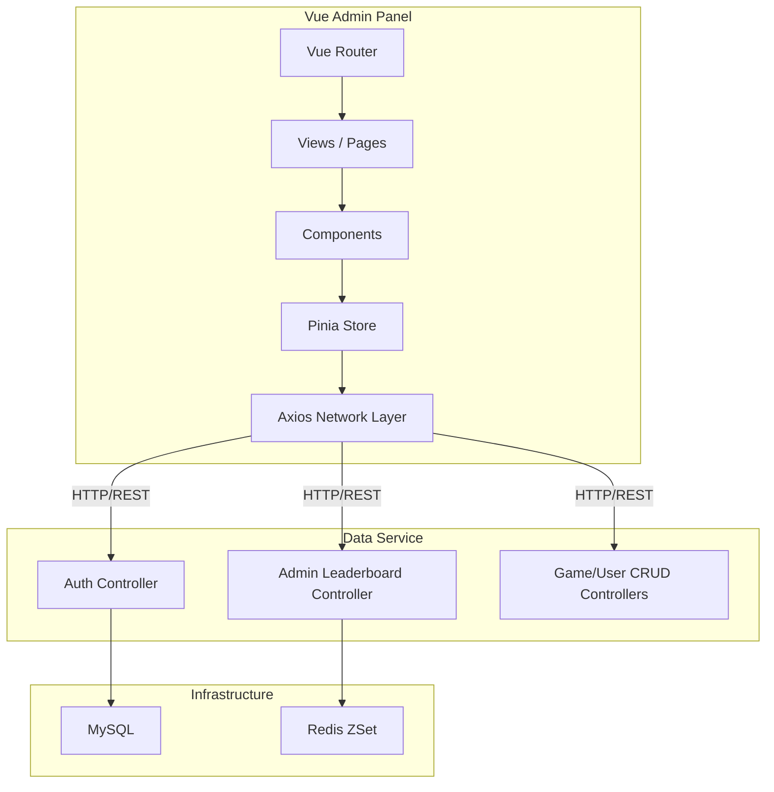

## 1. 架构设计

## 2. 技术描述
- **前端框架**: Vue 3 (Composition API, `<script setup>`)
- **构建工具**: Vite
- **状态管理**: Pinia
- **路由管理**: Vue Router 4
- **UI 组件库**: Element Plus
- **CSS 框架**: Tailwind CSS (辅助快速布局与原子类)
- **网络请求**: Axios (封装请求拦截器，自动携带 JWT Token，统一处理 ApiResponse 结构)

## 3. 路由定义

| 路由路径 | 页面名称 | 用途 |
|-------|---------|------|
| `/login` | Login | 管理员登录页，获取 JWT |
| `/` | Layout | 基础布局组件（包含侧边栏、顶栏），需要认证 |
| `/dashboard` | Dashboard | 控制台主页，展示总览数据 |
| `/games` | Game Management | 游戏列表及基础信息维护 |
| `/games/:id/platforms` | Game Platforms | 游戏各平台版本和下载链接维护 |
| `/users` | User Management | 玩家账号列表及封禁/资料编辑 |
| `/records` | Game Records | 通关流水记录查询 |
| `/leaderboards` | Leaderboard Ops | 运维：强制设置榜单分数、手动同步、触发容灾 |

## 4. API 交互定义

前端基于以下接口进行网络请求，统一解析后端的 `ApiResponse`：

- **认证**: 
  - `POST /api/auth/login/admin`
    - 请求: `?username=admin`
    - 响应: `{ "code": 200, "data": { "token": "...", "role": "ADMIN" } }`
- **后台运维**:
  - `POST /api/admin/leaderboard/sync`
    - 请求体: `GameData`
  - `PUT /api/admin/leaderboard/force-score`
    - 参数: `key`, `userId`, `score`
  - `POST /api/admin/leaderboard/disaster-recovery/{gameId}`
- **后台 CRUD (规划新增的接口，用于完善管理)**:
  - 游戏接口: `GET /api/admin/games`, `POST /api/admin/games`, `PUT`, `DELETE`
  - 平台接口: `GET /api/admin/games/{gameId}/platforms` ...
  - 用户接口: `GET /api/admin/users`, `PUT /api/admin/users/{id}`
  - 记录接口: `GET /api/admin/records`

*(前端请求拦截器将从 localStorage/Pinia 读取 Token 并添加 `Authorization: Bearer xxx` 请求头，响应拦截器负责处理 401 和错误提示)*