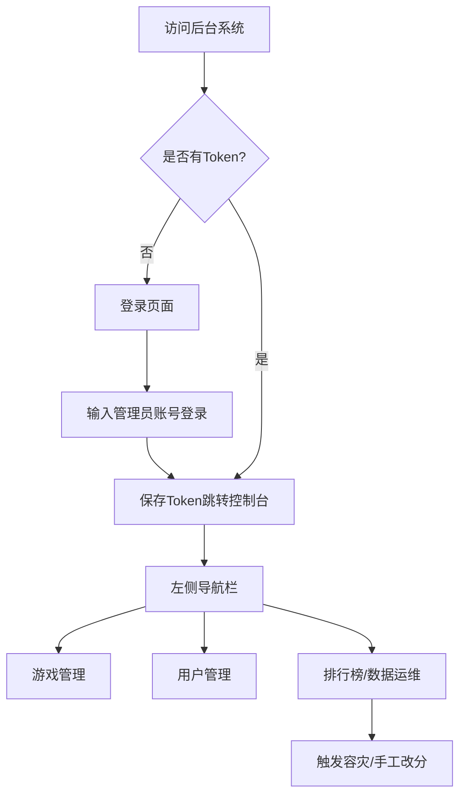

## 1. 产品概述
- 本项目为一个基于现有的游戏通关数据和排行榜数据而打造的后台管理系统 (Admin Panel)。
- 旨在为运营人员和管理员提供可视化的人工数据管理能力，支持查看和编辑游戏信息、各平台数据、玩家数据、通关流水，以及对排行榜进行手工干预（如强制改分、触发容灾恢复等）。

## 2. 核心功能

### 2.1 用户角色
| 角色 | 注册方式 | 核心权限 |
|------|---------------------|------------------|
| 管理员 (Admin) | 内部预设 / 暂用模拟登录 | 拥有全量数据（用户、游戏、平台、通关记录、排行榜管理）的读写和操作权限 |

### 2.2 功能模块
1. **登录页**: 管理员认证登录（对接现有的 `/api/auth/login/admin`）。
2. **控制台 (Dashboard)**: 核心数据总览（当前用户总数、游戏总数、今日新增记录等统计概览）。
3. **游戏管理 (Game Management)**: 游戏的增删改查（名称、代号、描述等），关联子表（游戏平台信息）的维护。
4. **用户管理 (User Management)**: 玩家资料的查看与管理（昵称、头像、关联的省市区划 ID 等）。
5. **记录管理 (Record Management)**: 查看和筛选通关流水记录。
6. **排行榜管理 (Leaderboard Management)**: 手动同步通关数据、强制设置某榜单特定用户的分数、针对特定游戏触发 Redis 容灾恢复。

### 2.3 页面详情
| 页面名称 | 模块名称 | 功能描述 |
|-----------|-------------|---------------------|
| 登录页 | 认证模块 | 管理员输入账号进行登录，获取并存储 JWT Token |
| 控制台 | 数据概览 | 以卡片或图表形式展示核心统计数据 |
| 游戏管理 | 游戏列表及平台表 | 列表展示、新建游戏、编辑基本信息、查看/编辑关联的各平台下载链接与版本号 |
| 用户管理 | 用户列表 | 列表展示玩家信息，支持按条件检索，可编辑地区、封禁等操作 |
| 记录管理 | 通关流水列表 | 列表展示用户的通关记录、关卡 ID 和通关时间 |
| 排行榜管理 | 数据运维面板 | 提供操作按钮：触发灾备恢复、强制分数干预弹窗、手动同步数据 |

## 3. 核心流程
1. **认证流程**: 用户访问系统 -> 检查 Token -> 无 Token 重定向至登录页 -> 登录成功存入 localStorage/Pinia -> 跳转控制台。
2. **数据运维流程**: 进入排行榜管理 -> 选中指定游戏 -> 点击“容灾恢复” -> 弹窗二次确认 -> 调用灾备接口重建 Redis 榜单。

## 4. 用户界面设计
### 4.1 设计风格
- **整体基调**: 现代化、科技感与效率优先的 B端后台风格。不使用过度复杂的动画，追求干净利落的交互体验。
- **色彩规范**: 
  - 主色调：深邃的科技蓝 (`#1890ff` 或 Tailwind 的 `blue-600`)
  - 侧边栏：深色模式 (`#001529` 或 Tailwind 的 `slate-900`)，以区分导航区和内容区。
  - 背景色：浅灰 (`#f0f2f5` 或 Tailwind 的 `gray-50`)
- **布局风格**: 经典的左右布局（左侧导航栏，右侧上部顶栏+面包屑，下部为主要内容区（卡片包裹））。
- **组件风格**: 采用圆角边框、轻量阴影突出卡片层级，表格紧凑，按钮带有清晰的 Hover 态反馈。

### 4.2 页面设计总览
| 页面名称 | 模块名称 | UI 元素 |
|-----------|-------------|-------------|
| 登录页 | 登录卡片 | 居中卡片，全屏渐变/插画背景，包含账号输入框与主色调登录按钮 |
| 控制台 | 数据卡片 | 顶部展示 4 个关键指标卡片（带有对应的 Icon），下方可放置折线图占位 |
| 列表管理页 | 表格与筛选区 | 顶部白色卡片包含筛选表单与“新增”按钮，下方卡片包含分页表格 |
| 弹窗/抽屉 | 表单区域 | 侧边划出的 Drawer 或居中 Dialog，带有明确的保存/取消按钮 |

### 4.3 响应式
- 桌面端优先 (Desktop-first)，左侧导航栏支持折叠以适配较小屏幕。
- 平板/移动端访问时，导航栏自动收起，表格支持横向滚动。